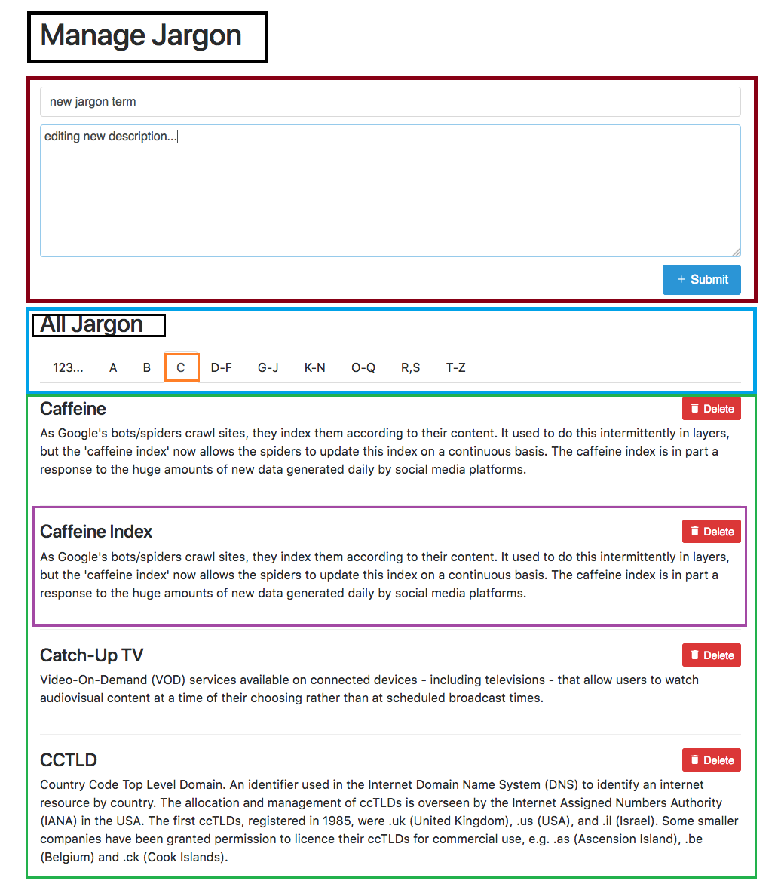

## My Approach

After examining both the screens and the description, I decided to follow
this approach:
```javascript
components/
  AddJargonFormComponent.js
  FilterJargonComponent.js
  FilterJargonLinkComponent.js
  Title.js
  VisibleJargonListComponent.js
  VisibleJargonListItemComponent.js
```
The best way to explain the structure is with a visual representation.
```javascript
Black: Title.js
Red: AddJargonFormComponent.js
Blue: FilterJargonComponent.js
Orange: FilterJargonLinkComponent.js
Green: VisibleJargonListComponent.js
Purple: VisibleJargonListItemComponent.js
```


This way all actions of children components can be managed by their parent and they are reusable.

I decided to implement AddJargonFormComponent. The following scenarios need to be tested:
* Button disables if the name field is empty
* Button disables if the dscription field is empty
* Button disables if the name already exist
* Warning appears if the name exists
* Already registered Jargon reminders appear
* If the name and description are valid, button appears and successfully submits the new Jargon
